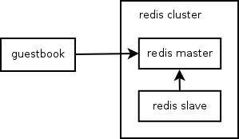
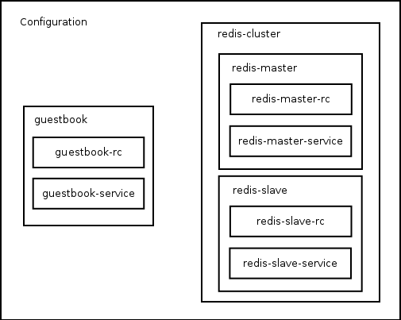

# Using Templates

## Overview

When you start building applications with
[multiple services talking to each other](connecting-services.md), your
configuration can get quite large and unweildy. It's big, it's got a lot of
pieces that are the same, and it's got important common data like ports and
service names scattered all over it like.

Templates allow you to create re-usable components for your config, which can
be parameterized according to your needs. Once you start using templates, you
will find your configurations cleaner and clearer, and looking more like your
system architecture.

**NOTE**: DM supports templates in both [Jinja](http://jinja.pocoo.org/) and
Python. The examples we're going to walk through use Jinja for simplicity, but
definitely check out some of the templates in our
[registry](https://github.com/kubernetes/application-dm-templates)
for python examples.

## Turn config into template

### Architecture

Let's start by taking a look at how the architecture of the guestbook
application looks. This will help when designing how to model the configuration
using templates.

### Resource model

We can model this architecture using templates to construct the configuration,
so that it looks something like this:

### Building the templates

## Paremeterizing

## Reusing

## Next steps

Next let's take a look at how you can make
[types out of templates](templates-to-types.md) to use DM to its fullest when
building configs out of templates.
